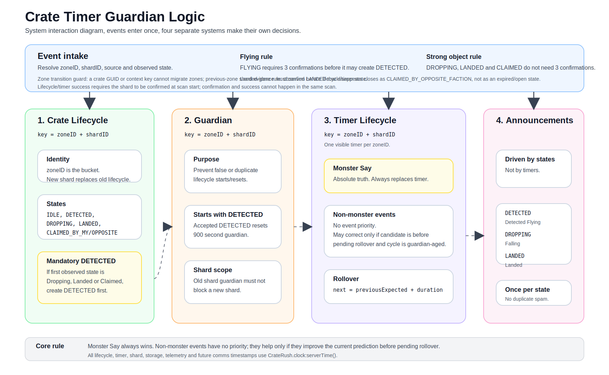

# Crate Timer Guardian Logic

Human and machine readable specification for CrateRush lifecycle, timer, guardian, and announcements.

## Companion Diagram

# 1. Executive summary

- Crate Lifecycle, Timer Lifecycle, Guardian and Announcements are separate systems.

- zoneID + shardID is the lifecycle and timer identity; zoneID owns the active visible slot.

- If the shard changes inside the same zone, the old lifecycle and timer are replaced.

- DETECTED -> DROPPING -> LANDED -> CLAIMED is lifecycle chronology, not timer priority.

- DETECTED may be created implicitly; other states must be observed.

- Monster Say is absolute truth and always replaces the timer.

- Non-monster events have no priority against each other. They can improve the timer only if they pull the anchor earlier toward the missed Monster Say before pending rollover.

- Timer rollover uses the previous expected timestamp plus zone duration, never now as the new base.

- All lifecycle, timer, guardian, shard confirmation, storage, telemetry and future comms timestamps use CrateRush.clock:serverTime().

# 2. Concepts and ownership

| **Concept**     | **Identity**                             | **Owns**                                                      | **Must not own**                  |
|-----------------|------------------------------------------|---------------------------------------------------------------|-----------------------------------|
| Crate Lifecycle | zoneID + shardID                         | Known crate state and lifecycle start                         | Timer correction policy           |
| Timer Lifecycle | zoneID + shardID, one visible per zoneID | Prediction of next Monster Say                                | State announcement decisions      |
| Guardian        | zoneID + shardID                         | Protection against false or duplicate lifecycle starts/resets | Timer authority or event priority |
| Announcements   | per lifecycle state                      | User facing messages once per accepted state                  | Timer or guardian decisions       |

# 3. Crate Lifecycle

A Crate Lifecycle belongs to one zoneID + shardID. zoneID is the main bucket. shardID is the current shard reality inside that bucket.

CrateLifecycleKey = zoneID + shardID

- If a new accepted lifecycle is detected for the same zoneID but a different shardID, delete the old lifecycle for that zone and create the new lifecycle.

- The old shard guardian must not block the new shard.

- This shard replacement rule applies to both lifecycle and timer records.

## 3.1 States

IDLE, DETECTED, DROPPING, LANDED, CLAIMED_BY_ALLIANCE, CLAIMED_BY_HORDE

For documentation, CLAIMED means either CLAIMED_BY_ALLIANCE or CLAIMED_BY_HORDE.

The normal chronological story is DETECTED -> DROPPING -> LANDED -> CLAIMED. This is useful for lifecycle understanding and announcements. It must not be used as timer priority logic.

## 3.2 Mandatory DETECTED

- Only DETECTED is mandatory.

- If the first observed state is DROPPING, LANDED or CLAIMED, create DETECTED implicitly first.

- Do not invent DROPPING, LANDED or CLAIMED. Those states exist only when directly observed.

- An accepted DETECTED starts or resets Guardian for the exact zoneID + shardID.

## 3.3 Event confirmation and recovery

- FLYING is noisy and requires three confirmations before it can create DETECTED.

- DROPPING, LANDED and CLAIMED are strong crate object states and do not require three confirmations.

- A live DROPPING, LANDED or CLAIMED object may recover missing lifecycle or timer state even if the vignette GUID was already seen before.

## 3.4 Zone transition ownership

A crate vignette GUID and its state-independent context key, for example Vignette-0-3892-0-102, belong to the first crate zone that observed them. If either appears under a different zone during transition, treat it as stale and do not use it for shard confirmation, lifecycle, timer or announcements.

If evidence uses the previous zone's shard while entering a new zone, it may be counted only for current-zone shard confirmation. It must not create lifecycle or timer state until that shard is confirmed for the current zone.

Crate lifecycle, timer and announcement success requires the event shard to be confirmed for the current zone at the start of the scan. A scan may confirm a shard, but it may not spend that same scan as crate state success.

# 4. Guardian

GuardianKey = zoneID + shardID

- Guardian protects lifecycle creation and lifecycle reset.

- Guardian exists to prevent false or duplicate lifecycle starts, for example a noisy single FLYING signal.

- Guardian duration is 900 seconds.

- Guardian does not directly control timers.

- Guardian does not directly control announcements.

- Because announcements are state driven, Guardian indirectly affects announcements by controlling whether a state can be created.

- Guardian for zoneID + shardA must never block zoneID + shardB.

# 5. Timer Lifecycle

Timer goal: predict the next Monster Say as accurately as possible. Monster Say is the only absolute truth. Everything else is evidence that may or may not improve the prediction.

TimerKey = zoneID + shardID

TimeSource = CrateRush.clock:serverTime()

- Raw GetServerTime() and GetTime() are not used directly in timer, lifecycle, shard, storage, telemetry or comms-ready logic.

Only one timer is displayed per zoneID, but internally it still belongs to zoneID + shardID.

## 5.1 Monster Say

- Monster Say always replaces the timer.

- Monster Say creates an authoritative timer anchor.

- No non-monster rule may block Monster Say from correcting the timer.

## 5.2 Non-monster events

- There is no timer priority between FLYING, DROPPING, LANDED and CLAIMED.

- The event name does not make the timer better or worse.

- The only question is whether the accepted event improves the current prediction of the next Monster Say.

- Compare the candidate timestamp with the current pending rollover / predicted Monster Say, not with the stored timer start.

- A non-monster event may correct the timer only when the current timer cycle is guardian-aged and the candidate is still before pending rollover.

- A non-monster event must not push the timer later after rollover.

if source == MONSTER_SAY:  
replaceTimer()  
elif noTimerExists:  
createFallbackTimer()  
elif now \< pendingRollover and cycleAge \>= guardianSeconds:  
replaceTimerAnchor() \# pull anchor earlier toward missed Monster Say  
else:  
keepTimer()

## 5.3 Timer rollover

nextTimestamp = previousExpectedTimestamp + zoneDuration

Do not use now + zoneDuration for rollover. Rollover preserves schedule continuity.

## 5.4 Timer examples

| **Situation**                                                                                                                         | **Existing prediction**                                 | **Observed event**                                                  | **Timer decision**                                                                                                 |
|---------------------------------------------------------------------------------------------------------------------------------------|---------------------------------------------------------|---------------------------------------------------------------------|--------------------------------------------------------------------------------------------------------------------|
| Timer already rolled over from a previous known anchor. At 12:19:20 a DROPPING object appears.                                        | Pending rollover/prediction already points to 12:36:40. | DROPPING at 12:19:20.                                               | Do not reset just because DROPPING appeared. It is not Monster Say and must not push timer later.                  |
| Fallback timer was created late from DROPPING at 12:05:00, predicting 12:23:20. Before rollover, a better anchor appears at 12:18:20. | 12:23:20 pending rollover.                              | Accepted event at 12:18:20 while before rollover and guardian-aged. | Correct the anchor, because the candidate is before pending rollover and improves the missed Monster Say estimate. |
| Same zone but new shard is accepted.                                                                                                  | Old zoneID + shardA timer exists.                       | New zoneID + shardB accepted.                                       | Replace old timer and lifecycle, because this is a different crate reality.                                        |

# 6. Announcements

Announcements are state driven. They are not driven by timer changes.

| **Accepted state**                     | **Announcement**             |
|----------------------------------------|------------------------------|
| DETECTED                               | War Crate Detected Flying    |
| DROPPING                               | War Crate Falling            |
| LANDED                                 | War Crate Landed             |
| CLAIMED_BY_ALLIANCE / CLAIMED_BY_HORDE | Claimed handling, if enabled |

- Announce once per accepted state per lifecycle.

- Do not spam duplicate announcements.

- Guardian affects announcements only indirectly by allowing or blocking state creation.

# 7. Machine contract

onCrateEvidence(event, zoneID, shardID, timestamp):  
zoneID = normalizeZone(zoneID)  
if not allowedZone(zoneID): return  
  
if event == FLYING:  
require 3 confirmations before DETECTED  
  
if event in {DROPPING, LANDED, CLAIMED_BY_ALLIANCE, CLAIMED_BY_HORDE}:  
strong object state; no 3x confirmation required  
may recover missing lifecycle/timer even if GUID was seen  
  
if acceptedShardChangedForSameZone(zoneID, shardID):  
delete old zone lifecycle  
delete old zone timer  
create new zoneID + shardID context  
  
if lifecycle start is accepted:  
create DETECTED if missing  
reset guardian(zoneID, shardID, 900)  
  
apply observed state if accepted  
fire announcement once per accepted state per lifecycle  
  
if source == MONSTER_SAY:  
replace timer anchor with timestamp  
elif no timer exists:  
create fallback timer from accepted event  
elif timestamp \< pendingRollover and cycleAge \>= guardianSeconds:  
replace timer anchor with timestamp  
else:  
keep existing timer  
  
onTimerRollover(timer):  
timer.nextExpected = timer.previousExpected + zoneDuration
