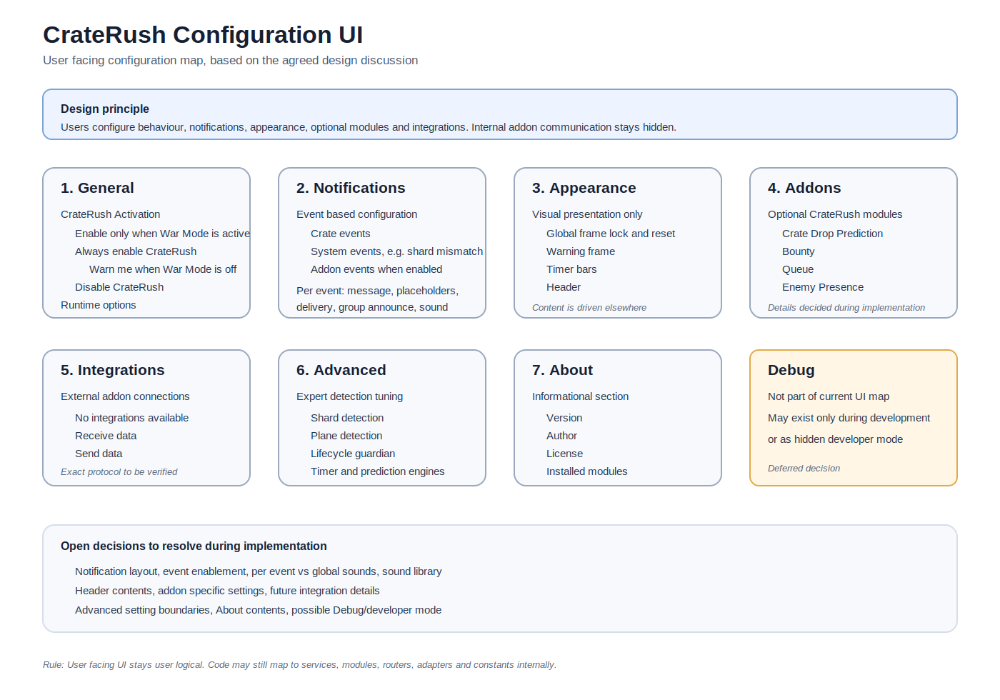

# CrateRush Configuration UI Design

User facing configuration structure based on the agreed CrateRush design discussion.

## Companion Diagram

# Purpose

The configuration UI is designed from a user perspective, not from internal addon architecture. Users should configure what the addon does, what notifications they receive, how information is displayed, and which optional modules are enabled.

Users should not need to understand lifecycle services, protocol messages, communication routers, state machines, or other implementation details.

# Top Level Structure

| **Section**       | **Purpose**                                    | **Status**                   |
|-------------------|------------------------------------------------|------------------------------|
| 1. General       | Global addon behaviour and activation.         | Locked                       |
| 2. Notifications | Event based notification configuration.        | Concept locked, layout open  |
| 3. Appearance    | Visual presentation of frames and UI elements. | High level locked            |
| 4. Addons        | Optional CrateRush modules.                    | Placeholder, details open    |
| 5. Integrations  | External addon connections.                    | High level locked            |
| 6. Advanced      | Expert tuning for detection and timing logic.  | High level locked            |
| 7. About         | Version, license and support information.      | Simple section, details open |

# Configuration Map

# 1. General

Purpose: Global addon behaviour and activation.

## CrateRush Activation

> Enable CrateRush only when War Mode is active  
> Always enable CrateRush  
> Warn me when War Mode is off  
> Disable CrateRush

The expected default is Enable CrateRush only when War Mode is active. The exact implementation logic will be finalised during implementation.

## General Options

- Show minimap button

# 2. Notifications

Purpose: Define which events generate notifications and how they are announced. Notifications are event driven. Users configure notifications per event, not per technical channel.

## Event Groups

- Crate Events: Crate detected, Crate dropping, Crate landed, Crate claimed

- System Events: Shard mismatch

- Addon Events: Visible only when corresponding addon is enabled

## Event Configuration Concept

- Message text box per event

- Placeholders such as %coords%, %mappin%, %zone%, %faction%, %player%

- Delivery options such as default chat frame and warning frame

- Group announcement with leader based safety logic

- Sound option with selectable sound

## Group Announcement Logic

- Party announcement only if the player is party leader

- Raid announcement only if the player is raid leader or assistant

- Use Raid Warning when possible should only apply when raid announcement is allowed

- Exact UI layout is open and will be discussed during implementation

# 3. Appearance

Purpose: Control visual presentation only. Appearance controls how information looks, not what content is shown.

## Global Appearance

- Lock all frames

- Unlock all frames

- Reset all positions

## Warning Frame

- Enable

- Position

- Width and height

- Font and font size

- Text colour

- Background colour

- Background transparency

- Test button

## Timer Bars

- Enable

- Position

- Width and height

- Font and font size

- Normal, warning and urgent colours

- Show countdown

- Show icon

- Test button

## Header

- Enable

- Position

- Font and font size

- Text colour

Remark: Final header contents are not yet defined. Possible content includes current crate state, shard information, version information and group information.

# 4. Addons

Purpose: Optional CrateRush modules. This section is intentionally left as a placeholder for now.

- Crate Drop Prediction

- Bounty

- Queue

- Enemy Presence

Rule: If a module is disabled, its related notification events should be hidden. If a module is enabled, related notification events become visible.

Remark: Module specific settings will be decided during implementation.

# 5. Integrations

Purpose: External addon integrations. Current integration target is Hated Crate Tracker.

- Enable integration

- Receive data from Hated Crate Tracker

- Send data to Hated Crate Tracker

- Optional future fields: integration status, detected version, last communication

Remark: Exact communication model and protocol details must be verified before implementation.

# 6. Advanced

Purpose: Expert tuning for detection accuracy, timing and internal decision making. This section must not become a miscellaneous settings drawer.

## Potential Advanced Groups

- Shard Detection: required confirmations, mismatch grace period, poll interval, poll duration

- Plane Detection: required sightings and confirmation time

- Lifecycle Guardian: guardian timeout, currently represented by a 900 second value

- Timer Engine: maximum unseen cycles and cleanup timing

- Prediction Engine: learning thresholds and confidence thresholds

Warning text to include: Changing advanced settings may reduce detection accuracy and reliability.

# 7. About

Purpose: Informational section at the end of the configuration UI.

- CrateRush version

- Author

- License

- Installed modules

- Installed integrations

- Potential future button: Copy support information

# Open Decisions

- Exact notification UI layout

- Event enable or disable behaviour

- Per event vs global sound configuration

- Full sound library

- Header contents

- Addon specific settings

- Integration status display

- Advanced section final contents

- About section final contents

- Possible future debug or developer mode
